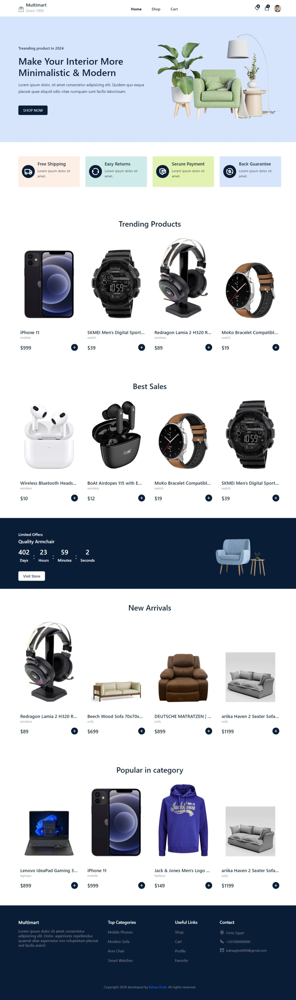

# Full Stack E-Commerce
Welcome to my Full Stack E-Commerce project! This project is built using the MERN (MongoDB, Express.js, React, Node.js) stack to create a great e-commerce application

<h2>Demo</h2>
You can try out the App here: <a href="https://multimart-bahaaghali000.vercel.app/">Multimart Demo</a>

## Features
- User Authentication (Signup, Login, Logout)
- Product Listing and Details
- Shopping Cart
- Admin Panel for Managing Products, Orders and Users
- Responsive Design
- and more...

## Technologies Used
- **Frontend:**
  - CSS
  - JavaScript
  - Framer-motion
  - React
  - Redux toolkit (for state management)
  - Bootstrap
- **Backend:**
  - Node.js
  - Express.js
  - MongoDB (Atlas or locally hosted)
  - Mongoose
- **Authentication:**
  - JSON Web Tokens (JWT)
- **Deployment:**
  - Render, Vercel

